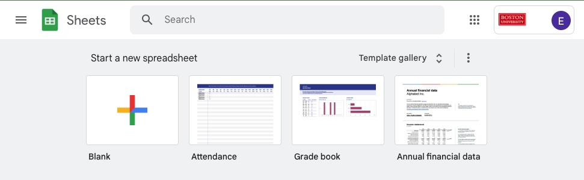
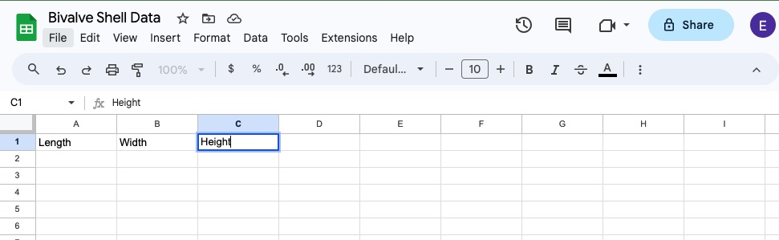
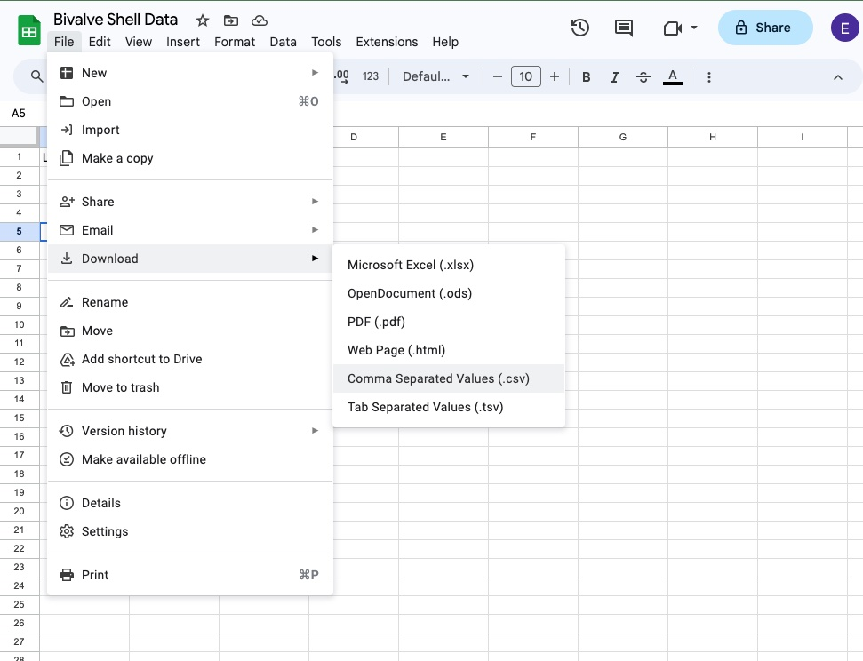
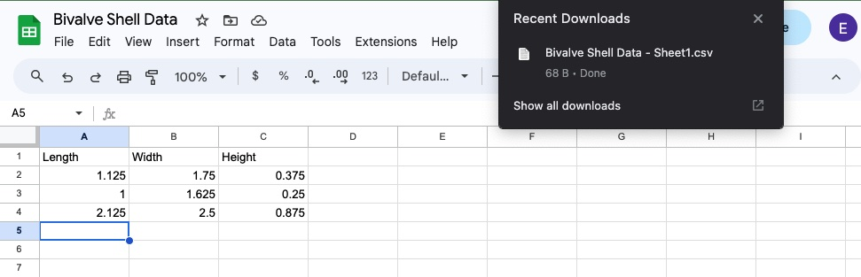

# Context

In the main Workshop Exercise you are asked to do data entry using Google Sheets, then export to a "csv" file which encodes tabular data in plain text. This additional handout gives step-by-step instructions with screen shot illustrations for those less familiar with Google Sheets.

## Step 1

Begin by navigating to [https://docs.google.com/spreadsheets/u/0/](https://docs.google.com/spreadsheets/u/0/) and creating a blank Google Sheets document.

## Step 2

Next, name columns for heigh, width, and length measurements by typing these names into the top row.

Fill in the measurements as you go.

## Step 3

Once you have finished data collection and entry, use the "File" menu to Download the sheet as "Comma Separated Values" (.csv).

## Step 4

The "csv" file will then go to your Downloads folder.

